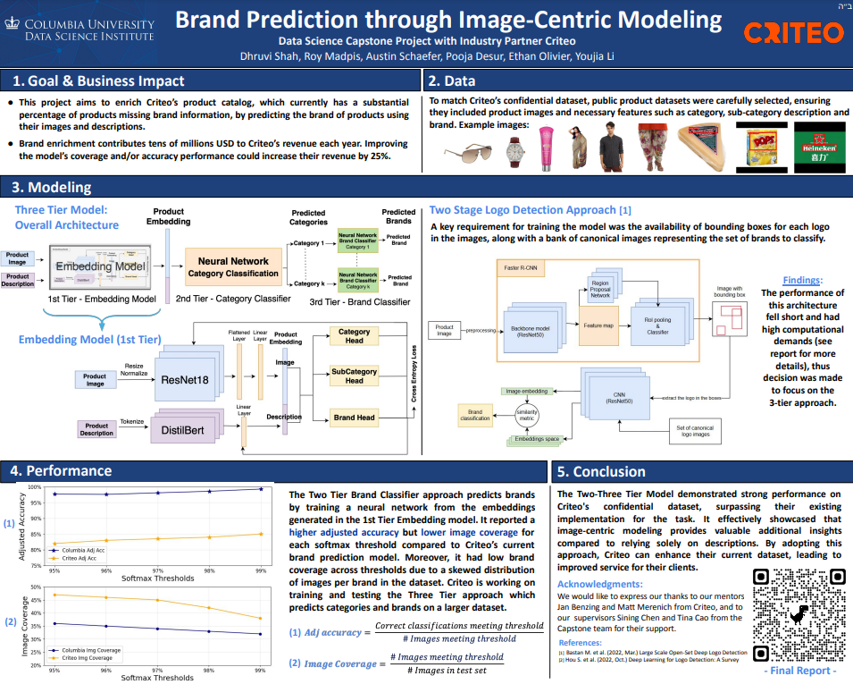

# Brand Prediction through Image-Centric Modeling
The Capstone Project is a collaboration between Columbia University and Criteo. This project aims to enhance product brand recognition and categorization within Criteo's extensive image catalog by developing a multi-tier embedding and classification framework. Our approach integrates both image and text data, using a pre-trained ResNet model for image embeddings and a pre-trained language model (distilbert) for text descriptions. These embeddings are concatenated to form a comprehensive representation of each product, which feeds into classification heads for predicting categories and brands. The project also experiments with a 2-stage logo detection model to identify logo regions, further improving accuracy in brand recognition.
Due to the confidentiality of Criteo’s data, open-source datasets focused on fashion and food products were utilized to construct and evaluate the modeling approach. The proposed 2-3 tier architecture demonstrated significant potential, prompting Criteo to test it on a sample dataset, where it outperformed their existing brand classification model. Future work includes scaling the framework to larger datasets and exploring more complex implementations of the architecture, leveraging Criteo’s computational resources for further refinement.

Brand enrichment contributes tens of millions USD to Criteo’s revenue each year. Improving the model’s coverage and/or accuracy performance could increase their revenue by 25%.

**Link to the final report:** https://docs.google.com/document/d/1DgYAIO945XX4XblKokCUWvQdzF6yWko_aNkJm4LrlgI/edit?usp=sharing

Poster summarizing the work: [F24_Criteo_Image_Zero_Shot_Segmentation_Poster.pptx.pdf](https://github.com/user-attachments/files/18083522/F24_Criteo_Image_Zero_Shot_Segmentation_Poster.pptx.pdf)
